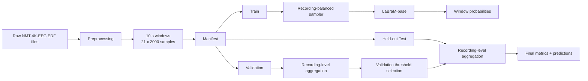

# LaBraM Fine-Tuning for NMT-4K-EEG

<p align="center">
  <b>Recording-level normal vs. abnormal EEG classification on NMT-4K-EEG using the LaBraM foundation model</b>
</p>

<p align="center">
  <a href="https://www.python.org/"></a>
  <a href="https://pytorch.org/"></a>
  
  <a href="https://github.com/935963004/LaBraM"></a>
  <a href="https://doi.org/10.5281/zenodo.21405022"></a>
</p>

---

## Overview

This repository adapts **LaBraM (Large Brain Model)** for **binary clinical EEG abnormality classification** on the **NMT-4K-EEG** dataset. It provides an NMT-specific fine-tuning pipeline around the pretrained LaBraM backbone, with recording-aware sampling, subject/recording-safe train-validation-test handling, modern PyTorch AMP support, checkpoint validation, recording-level aggregation, and reproducible metric export.

The implementation is designed for continuous clinical EEG that has been converted into fixed-length windows. Each window is classified by LaBraM, then window probabilities are aggregated to produce a **single probability per EEG recording**, which is the primary level used for validation threshold selection and final test reporting.

### Key features

- LaBraM-base fine-tuning for **normal vs. abnormal EEG classification**
- NMT-specific **21-channel positional mapping** for pretrained LaBraM embeddings
- **10-second EEG windows** at 200 Hz with expected shape `(21, 2000)`
- Recording-balanced sampling so long EEGs do not dominate training
- Validation split created only from the original training partition
- Held-out evaluation recordings preserved for final testing
- Validation-only threshold optimization using recording-level balanced accuracy
- Window-level and recording-level metrics
- Accuracy, balanced accuracy, F1, sensitivity, specificity, AUROC, and PR-AUC
- Native PyTorch AMP with automatic BF16/FP16 selection
- Gradient accumulation, cosine learning-rate schedule, early stopping, resume support, and checkpoint export
- Environment and pretrained-checkpoint integrity checks
- Windows PowerShell and Linux shell helper scripts

---

## Model and dataset

### LaBraM

[LaBraM](https://github.com/935963004/LaBraM) is an EEG foundation model introduced in the ICLR 2024 Spotlight paper **“Large Brain Model for Learning Generic Representations with Tremendous EEG Data in BCI.”** This repository uses the pretrained **LaBraM-base** backbone and replaces the original pretraining head with a one-logit binary classification head for NMT-4K-EEG abnormality detection.

### NMT-4K-EEG

[NMT-4K-EEG](https://doi.org/10.5281/zenodo.21405022) is a clinical EEG resource containing 4,500 recordings from 4,500 unique subjects. The dataset provides a predefined training/evaluation split, neurologist-verified normal/abnormal interpretations, de-identified clinical reports, and event-level annotations for abnormal recordings.

For the LaBraM pipeline in this repository, the model input uses **21 EEG/reference channels**: the 19 scalp EEG channels plus `A1` and `A2`. The auxiliary ECG channel is not used as model input.

---

## Pipeline



The critical design choice is that **all windows from a recording stay in the same split**. Validation is derived only from training recordings, while the original NMT evaluation partition remains untouched until final testing.

---

## Expected EEG representation

Each preprocessed EEG window must be a Python pickle containing at least:

```python
{
    "X": numpy.ndarray,  # shape: (21, 2000), float-like
    "y": int            # 0 = normal, 1 = abnormal
}
```

The expected signal configuration is:

| Property | Value |
|---|---|
| Window duration | 10 seconds |
| Sampling rate | 200 Hz |
| Samples per channel | 2,000 |
| Input channels | 21 |
| Input tensor shape | `(21, 2000)` |
| Label space | `0 = normal`, `1 = abnormal` |
| Signal unit | microvolts |
| LaBraM input scaling | `signal / 100` |

### Channel order

The exact channel order used by this implementation is:

```text
FP1, FP2, F3, F4, C3, C4, P3, P4, O1, O2,
F7, F8, T3, T4, T5, T6, A1, A2, FZ, CZ, PZ
```

The mapping in `nmt_finetuning/channels.py` converts these channel names into the positional indices expected by LaBraM's pretrained 10-20 channel embedding map.

---

## Repository structure

```text
.
├── run_nmt_finetuning.py          # Main training/evaluation entry point
├── prepare_nmt_manifest.py        # Recording-safe train/val/test manifest builder
├── check_labram_environment.py    # CUDA, package, GPU, and checkpoint validation
├── requirements_nmt_cuda128.txt   # Maintained Python dependency set
├── constraints_nmt_cuda128.txt    # Prevents CUDA PyTorch trio replacement
├── cuda12.8_requirements.txt      # Compatibility alias
├── COMPATIBILITY_REPORT.md        # Environment + dataset audit report
│
├── nmt_finetuning/
│   ├── channels.py                # NMT -> LaBraM channel mapping
│   ├── data.py                    # Dataset, manifest, split, balanced sampler
│   └── metrics.py                 # Window/recording metrics and threshold tuning
│
├── preprocess/
│   ├── preprocess_nmt_with_metadata.py
│   └── gpu_check.py
│
├── scripts/
│   ├── setup_nmt_cuda128.ps1
│   ├── train_nmt_cuda128.ps1
│   ├── train_nmt_cuda128.sh
│   ├── evaluate_nmt_cuda128.ps1
│   └── repair_labram_checkpoint.ps1
│
├── data/
│   ├── nmt_finetune_manifest.csv
│   ├── windows_inspection_report.csv
│   └── nmt_full_dataset_inspection_report.csv
│
└── LaBraM/                        # Required upstream LaBraM source (see setup below)
    ├── modeling_finetune.py
    └── checkpoints/
        └── labram-base.pth
```

> **Important:** the fine-tuning runner imports `modeling_finetune.py` from `./LaBraM` and expects the pretrained checkpoint at `./LaBraM/checkpoints/labram-base.pth`. If the upstream source/checkpoint are not included in your checkout, add them before training.

---

## Installation

### 1. Clone this repository

```bash
git clone https://github.com/sehrishkazmi/Implementation-of-LaBraM-on-NMT-4K-EEG-Dataset.git
cd Implementation-of-LaBraM-on-NMT-4K-EEG-Dataset
```

### 2. Add the upstream LaBraM source

Place the official LaBraM repository under `./LaBraM`:

```bash
git clone https://github.com/935963004/LaBraM.git LaBraM
```

Obtain the official pretrained **LaBraM-base** checkpoint from the upstream project and place it at:

```text
LaBraM/checkpoints/labram-base.pth
```

### 3. Create a Python environment

Python **3.10 or 3.11** is recommended.

Using Conda:

```bash
conda create -n labram-nmt python=3.11 -y
conda activate labram-nmt
```

### 4. Install PyTorch with CUDA 12.8

For the environment targeted by this repository:

```bash
python -m pip install torch==2.10.0 torchvision==0.25.0 torchaudio==2.10.0 \
  --index-url https://download.pytorch.org/whl/cu128
```

Then install the remaining dependencies:

```bash
python -m pip install -r requirements_nmt_cuda128.txt -c constraints_nmt_cuda128.txt
```

> Do **not** install the legacy upstream LaBraM dependency file afterward if it downgrades `timm`. This adaptation is prepared around `timm==0.9.16` and the maintained dependency set in this repository.

---

## Environment validation

Before preprocessing or training, run:

```bash
python check_labram_environment.py
```

The checker verifies:

- Python compatibility
- PyTorch, torchvision, and torchaudio versions
- CUDA 12.8 runtime
- GPU availability
- compiled CUDA architecture support
- an actual CUDA matrix multiplication smoke test
- NumPy/timm compatibility
- existence and ZIP integrity of `labram-base.pth`

For a CPU-only diagnostic check:

```bash
python check_labram_environment.py --cpu-ok
```

### Windows helper

```powershell
powershell -ExecutionPolicy Bypass -File .\scripts\setup_nmt_cuda128.ps1
```

If the PyTorch CUDA trio needs to be reinstalled:

```powershell
powershell -ExecutionPolicy Bypass -File .\scripts\setup_nmt_cuda128.ps1 -ReinstallTorch
```

---

## Data preparation

There are two supported entry points: use already-preprocessed windows, or preprocess raw EDF recordings first.

### Option A: use preprocessed windows

The training code expects `.pkl` windows organized on disk and a CSV manifest with these columns:

```text
file_path, split, label, recording_id, window_index
```

where `split` is one of:

```text
train, val, test
```

A manifest is already present under `data/nmt_finetune_manifest.csv` in the uploaded project snapshot. Its file paths are machine-specific, so update/regenerate them for your local storage location before training.

### Option B: preprocess raw EDF recordings

The repository includes `preprocess/preprocess_nmt_with_metadata.py`, which is designed to convert raw NMT EEGs into verified LaBraM-compatible windows while also writing processing provenance and audit reports.

Example:

```bash
python preprocess/preprocess_nmt_with_metadata.py \
  --metadata-csv path/to/metadata.csv \
  --raw-root path/to/NMT-4K-EEG \
  --output-root path/to/NMT_processed \
  --window-report data/windows_inspection_report.csv \
  --edf-report data/edf_processing_report.csv \
  --workers 3
```

Default preprocessing settings in the script are:

- resampling target: **200 Hz**
- window length: **10 s**
- band-pass: **0.1-75 Hz**
- notch: **50 Hz**
- notch Q: **30**
- filter order: **4**
- output dtype: **float32**

For a small trial run before processing the entire dataset:

```bash
python preprocess/preprocess_nmt_with_metadata.py \
  --metadata-csv path/to/metadata.csv \
  --raw-root path/to/NMT-4K-EEG \
  --output-root path/to/NMT_processed \
  --limit 10
```

The preprocessing implementation uses atomic writes and persistent per-recording state to make interrupted runs safer to resume.

---

## Manifest generation

`prepare_nmt_manifest.py` creates a recording-level validation split from the original training recordings while keeping the original evaluation recordings as the final test split.

Example using the CLI implemented in the current script:

```bash
python prepare_nmt_manifest.py \
  --report-csv path/to/windows_inspection_report.csv \
  --data-dir path/to/NMT_processed \
  --output data/nmt_finetune_manifest.csv \
  --val-fraction 0.15 \
  --seed 2026
```

The split logic is recording-safe:

- original evaluation recordings -> `test`
- a stratified subset of original training recordings -> `val`
- remaining original training recordings -> `train`
- all windows from the same EEG recording remain in exactly one split

---

## Fine-tuning

The canonical training entry point is:

```bash
python run_nmt_finetuning.py \
  --manifest data/nmt_finetune_manifest.csv \
  --checkpoint LaBraM/checkpoints/labram-base.pth \
  --output-dir outputs/nmt_labram_base \
  --epochs 30 \
  --batch-size 16 \
  --update-freq 4 \
  --epoch-size 50000 \
  --num-workers 3 \
  --amp-dtype auto \
  --allow-unsafe-checkpoint
```

The default batch size is 16 with four-step gradient accumulation, giving an **effective batch size of 64**.

### Lower-memory configuration

For GPUs with limited VRAM:

```bash
python run_nmt_finetuning.py \
  --manifest data/nmt_finetune_manifest.csv \
  --checkpoint LaBraM/checkpoints/labram-base.pth \
  --output-dir outputs/nmt_labram_base \
  --epochs 30 \
  --batch-size 8 \
  --update-freq 8 \
  --epoch-size 50000 \
  --amp-dtype auto \
  --allow-unsafe-checkpoint
```

This keeps the effective batch size at 64 while reducing per-step memory usage.

### Use all training windows per epoch

Set:

```bash
--epoch-size 0
```

instead of the default recording-balanced draw of 50,000 windows per epoch.

---

## Training defaults

| Parameter | Default |
|---|---:|
| Epochs | 30 |
| Batch size | 16 |
| Gradient accumulation | 4 |
| Effective batch size | 64 |
| Balanced windows per epoch | 50,000 |
| Learning rate | `5e-4` |
| Minimum LR | `1e-6` |
| Warmup LR | `1e-6` |
| Warmup epochs | 5 |
| Weight decay | 0.05 |
| Layer decay | 0.65 |
| Drop path | 0.1 |
| Gradient clipping | 3.0 |
| Early-stopping patience | 10 |
| Validation windows/recording | 64 |
| Test windows/recording | all |
| Selection metric | balanced accuracy |
| Random seed | 2026 |
| Sampling strategy | recording-balanced |

Mixed precision is selected automatically:

- BF16 if the CUDA device reports support
- otherwise FP16
- disabled automatically on CPU

---

## Why recording-balanced sampling matters

Clinical EEG recordings can contribute very different numbers of 10-second windows. Uniformly sampling windows would therefore cause long recordings to dominate model updates.

The sampler in `nmt_finetuning/data.py` addresses this by assigning each training window a weight proportional to:

```text
1 / (number of recordings in its class * number of windows in its recording)
```

This has two effects:

1. normal and abnormal recordings receive balanced class-level sampling mass;
2. each recording receives approximately equal total sampling probability regardless of duration.

This is especially important for this repository's audited preprocessing snapshot, where recordings contain between **3 and 1,082 windows**.

---

## Recording-level evaluation

The model produces probabilities at the window level, but the primary clinical target is the complete EEG recording.

For each recording, the implementation computes:

```text
recording_probability = mean(window_probabilities)
```

The classification threshold is selected **only on validation recordings** by searching thresholds from 0.05 to 0.95 and maximizing balanced accuracy. If multiple thresholds tie, the value closest to 0.5 is selected.

The final held-out test set is then evaluated using this validation-derived threshold.

### Reported metrics

The pipeline exports:

- Accuracy
- Balanced accuracy
- F1 score
- Sensitivity
- Specificity
- ROC-AUC
- PR-AUC

Metrics are produced at both window and recording levels, with recording-level performance being the primary result for EEG abnormality classification.

---

## Outputs

By default, outputs are written to:

```text
outputs/nmt_labram_base/
```

| File | Description |
|---|---|
| `best.pt` | Best checkpoint selected by the configured validation metric |
| `last.pt` | Most recent training checkpoint for resuming |
| `history.json` | Epoch-by-epoch training and validation history |
| `test_metrics.json` | Final window-level and recording-level test metrics |
| `test_recording_predictions.csv` | One probability and prediction per EEG recording |

---

## Resume training

Resume from the latest fine-tuned checkpoint:

```bash
python run_nmt_finetuning.py \
  --resume outputs/nmt_labram_base/last.pt \
  --manifest data/nmt_finetune_manifest.csv \
  --checkpoint LaBraM/checkpoints/labram-base.pth \
  --output-dir outputs/nmt_labram_base \
  --allow-unsafe-checkpoint
```

Keep the important training/data arguments consistent with the original run when resuming.

---

## Evaluation only

Evaluate an existing fine-tuned checkpoint without further training:

```bash
python run_nmt_finetuning.py \
  --manifest data/nmt_finetune_manifest.csv \
  --checkpoint LaBraM/checkpoints/labram-base.pth \
  --resume outputs/nmt_labram_base/best.pt \
  --output-dir outputs/nmt_labram_base \
  --eval-only \
  --batch-size 16 \
  --amp-dtype auto \
  --allow-unsafe-checkpoint
```

---

## Repository audit snapshot

`COMPATIBILITY_REPORT.md` records the following audit for the preprocessing snapshot bundled with this project:

| Source split | Normal recordings | Abnormal recordings | Windows |
|---|---:|---:|---:|
| Train | 2,795 | 704 | 383,464 |
| Evaluation/test | 537 | 460 | 109,912 |
| **Total** | **3,332** | **1,164** | **493,376** |

Additional audit findings:

- 493,376 inspected pickle windows had shape `(21, 2000)` and were marked valid.
- The audited windows represented 4,496 EEG recordings.
- Four dataset recordings had no valid generated pickle windows in that snapshot: one training normal and three evaluation normals.
- Validation was generated only from original training recordings.
- No recording overlap was found across train, validation, and test in the reported dry run.

These numbers describe the **repository's audited preprocessing snapshot**, not a redefinition of the full NMT-4K-EEG dataset size.

---

## Reproducibility and safety notes

### Checkpoint loading

The official LaBraM checkpoint may contain legacy Python objects in addition to tensor weights. The runner first attempts safe `weights_only=True` loading with a restricted allowlist.

Use:

```text
--allow-unsafe-checkpoint
```

**only for a checkpoint you trust.** Never use this flag with an untrusted `.pth` file.

### Split integrity

Do not use the original NMT evaluation partition for hyperparameter tuning, threshold selection, or early stopping. The repository intentionally derives validation data only from the original training partition.

### Manifest paths

The included manifest contains absolute paths from the machine on which it was created. Update or regenerate the manifest before running on another system.

---

## Troubleshooting

### `ModuleNotFoundError: modeling_finetune`

The upstream LaBraM source is missing from `./LaBraM`.

Expected file:

```text
LaBraM/modeling_finetune.py
```

### `Checkpoint not found`

Place the pretrained checkpoint at:

```text
LaBraM/checkpoints/labram-base.pth
```

or pass another path using:

```text
--checkpoint path/to/labram-base.pth
```

### CUDA architecture / RTX 50-series errors

Run:

```bash
python check_labram_environment.py
```

For the environment targeted by this repository, the checker expects the CUDA 12.8 PyTorch build and validates the compiled GPU architecture list.

### NumPy / pandas / binary ABI errors

Use the maintained dependency set:

```bash
python -m pip install -r requirements_nmt_cuda128.txt -c constraints_nmt_cuda128.txt
```

The repository intentionally pins NumPy 1.26.4 for compatibility with the surrounding scientific Python stack used by this implementation.

### Out of memory

Reduce batch size and increase gradient accumulation, for example:

```text
--batch-size 8 --update-freq 8
```

### Dataset path errors

Regenerate or edit `data/nmt_finetune_manifest.csv` so every `file_path` points to an existing local `.pkl` window.

---

## Implementation notes

This adaptation preserves important LaBraM fine-tuning choices used by the supplied code:

- model: `labram_base_patch200_200`
- patch length: 200 samples
- 10 patches per 10-second channel window
- absolute positional embeddings enabled
- relative positional bias disabled
- QKV bias disabled
- layer decay: 0.65
- input scaling: microvolts divided by 100
- AdamW optimization
- cosine learning-rate schedule with warmup
- one-logit binary output head

The pretrained backbone is loaded while incompatible pretraining-head tensors are skipped. The runner verifies meaningful backbone-state coverage before allowing training to continue.

---

## Citation

If you use this repository, please cite both **LaBraM** and the **NMT-4K-EEG dataset/Data Descriptor**.

### LaBraM

```bibtex
@inproceedings{jiang2024large,
  title     = {Large Brain Model for Learning Generic Representations with Tremendous EEG Data in BCI},
  author    = {Jiang, Wei-Bang and Zhao, Li-Ming and Lu, Bao-Liang},
  booktitle = {The Twelfth International Conference on Learning Representations},
  year      = {2024},
  url       = {https://openreview.net/forum?id=QzTpTRVtrP}
}
```

### NMT-4K-EEG

Dataset record:

```text
https://doi.org/10.5281/zenodo.21405022
```

Please use the citation information provided with the NMT-4K-EEG release/Data Descriptor when publishing results obtained from this dataset.

---

## Upstream acknowledgements

This repository is an adaptation for NMT-4K-EEG and builds on the official LaBraM implementation by Wei-Bang Jiang, Li-Ming Zhao, and Bao-Liang Lu:

- LaBraM repository: https://github.com/935963004/LaBraM
- ICLR 2024 paper: https://openreview.net/forum?id=QzTpTRVtrP

The upstream authors should be credited according to their repository and paper citation guidance.

---

## License

The manuscript associated with this implementation describes the source code and notebooks as being released under the **MIT License**. Before public archival/release of this repository, ensure that a root-level `LICENSE` file is present and that licensing of any vendored upstream LaBraM components remains consistent with the upstream project's terms.

---

## Disclaimer

This implementation is intended for research and benchmarking. It is **not a medical device** and should not be used as a substitute for clinical EEG interpretation, diagnosis, or patient-care decisions.
