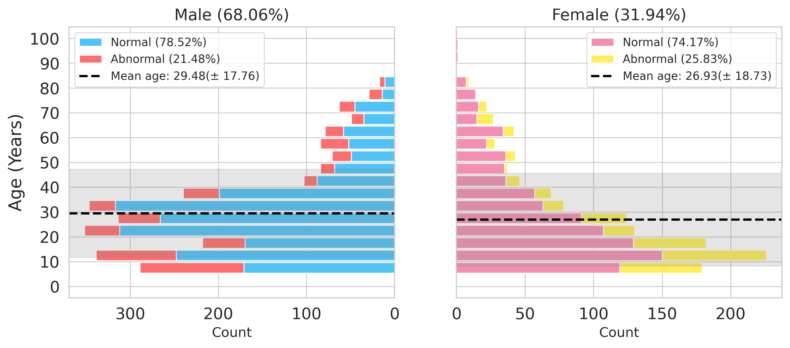
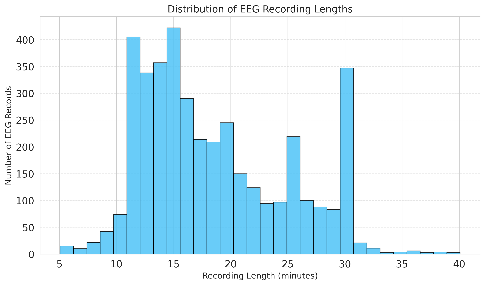
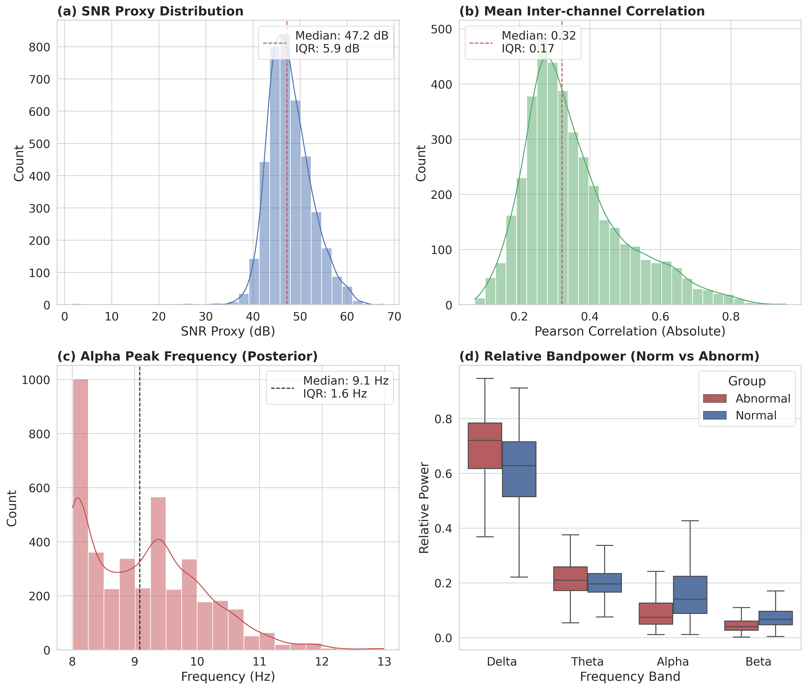
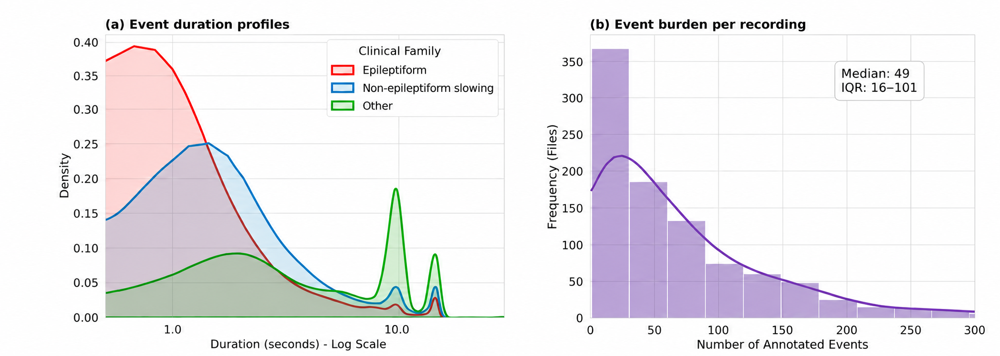

# NMT-4K-EEG Dataset Code and Validation Repository

[](https://doi.org/10.5281/zenodo.21041582)
[](https://doi.org/10.5281/zenodo.20830355)


This repository contains the code, notebooks, validation routines, and saved analysis outputs used to curate, validate, package, and describe **NMT-4K-EEG**, a multimodal clinical electroencephalography dataset collected during routine hospital practice in Pakistan.

The dataset contains continuous EEG recordings, expert event annotations for abnormal recordings, anonymized clinical EEG reports, and a predefined subject-wise training and evaluation split. The dataset itself is distributed separately through Zenodo. A fixed archival release of this code and validation repository is also available through Zenodo for reproducible citation.

- **Dataset record:** [https://doi.org/10.5281/zenodo.21041582](https://doi.org/10.5281/zenodo.21041582)
- **Code and validation repository archive:** [https://doi.org/10.5281/zenodo.20830355](https://doi.org/10.5281/zenodo.20830355)
- **Full EDF Viewer:** [https://dll-ncai.github.io/full_edf_viewer/](https://dll-ncai.github.io/full_edf_viewer/)

## Dataset at a glance

| Item | Description |
|---|---|
| Total recordings | 4,500 routine clinical EEG recordings from unique subjects |
| Recording-level classes | 3,336 normal and 1,164 abnormal |
| Training partition | 3,500 recordings, including 2,796 normal and 704 abnormal |
| Evaluation partition | 1,000 recordings, including 540 normal and 460 abnormal |
| Signal format | European Data Format, `.edf` |
| Channels | 19 scalp channels using the International 10-20 system |
| Sampling frequency | 200 Hz |
| Acquisition resolution | Native 12-bit acquisition |
| Event annotations | 72,754 expert-labeled events for abnormal recordings |
| Annotation format | Comma-separated value files, `.csv` |
| Event taxonomy | 12 canonical labels organized into three clinical families |
| Clinical reports | 4,500 anonymized reports in plain text, `.txt` |
| Subject age | Six years and older |
| Data split | Fixed subject-wise training and evaluation partitions |

The released EDF recordings remain continuous and unsegmented. No preprocessing, artifact rejection, re-referencing, or manual signal cleaning was applied before release. Physiological and non-physiological artifacts from routine clinical acquisition are therefore retained.

## Data modalities

### Continuous EEG signals

Each recording is provided as an EDF file. The signals retain the original acquisition characteristics, including the 19-channel scalp montage, 200 Hz sampling frequency, linked-ear reference during acquisition, and native 12-bit system characteristics.

### Event-level annotations

Recordings interpreted as abnormal include annotation CSV files. Each event contains:

| Field | Description |
|---|---|
| `Gender` | Recorded gender field from the source clinical record |
| `Age` | Subject age at the time of acquisition |
| `File Start` | Recording clock start time |
| `Start time` | Event onset clock time |
| `End time` | Event offset clock time |
| `Channel names` | Channels in which the event was most prominent |
| `Comment` | Clinical event label |

Normal recordings do not contain event annotation CSV files. Temporal overlap between events is permitted because different EEG patterns may occur at the same time or across different channel subsets.

### Clinical reports

Every recording is linked to an anonymized clinical report in TXT format. The reports retain the main clinical sections:

- `Indication`
- `Factual Findings`
- `Impression`

Reports contain recording-level clinical information. They are not explicitly aligned with individual waveform samples or event annotations.

### Recording identifiers

Files belonging to the same recording use a shared anonymized base identifier. Identifiers follow the source and year convention used during curation, for example:

```text
mh_2023_0000001.edf
mh_2023_0000001.csv
mh_2023_0000001.txt
```

The same convention is used for `ffh` identifiers. The CSV file is present only when the recording was interpreted as abnormal.

## Repository structure

```text
NMT-4K-EEG-Dataset/
├── notebooks/
│   ├── 01_dataset_characterization/
│   │   ├── Abnormality_stats.ipynb
│   │   └── Datastats.ipynb
│   ├── 02_data_validation/
│   │   └── validation_data.ipynb
│   ├── 03_technical_validation/
│   │   ├── data_analysis_paper.ipynb
│   │   └── Paper_Stats.ipynb
│   └── 04_manuscript_outputs/
│       └── final_paper_plot.ipynb
├── Scripts/
│   ├── Dataset Curation/
│   │   ├── build_dataset_manifest_and_split.py
│   │   └── package_release_files.py
│   ├── Integrity/
│   │   └── generate_sha256_checksums.py
│   └── Validation/
│       └── verify_release_structure.py
└── Outputs/
    ├── figures/
    ├── nmt4k_analysis_results/
    ├── nmt4k_event_level_stats/
    ├── nmt4k_event_stats_out/
    ├── nmt4k_signal_quality/
    ├── nmt4k_step1_out/
    ├── nmt4k_validation_out/
    ├── Stats Ouput/
    └── Validation Report/
```

## Notebooks

### `01_dataset_characterization/Abnormality_stats.ipynb`

This notebook analyzes abnormal event labels and recording-level abnormality patterns. It includes:

- Normalization of free-text clinical labels
- Mapping of label variants to canonical event labels
- Event frequency by annotation row
- Event frequency by recording
- Single and multiple abnormality combinations
- Label co-occurrence summaries
- Age and gender distributions across abnormality groups
- Tables and plots used to describe the event annotations

### `01_dataset_characterization/Datastats.ipynb`

This notebook describes the recording cohort and produces demographic and duration figures. It includes:

- Age distribution summaries
- Recorded gender distribution
- Normal and abnormal counts by age and gender
- Population pyramid visualization
- Recording duration distribution
- Dataset-level descriptive figures

### `02_data_validation/validation_data.ipynb`

This notebook performs EDF and annotation consistency checks. It includes:

- EDF readability checks
- Sampling frequency extraction
- Recording duration extraction
- Channel inventory checks
- Missing and additional channel summaries
- EDF-to-annotation file linkage
- Event onset and offset parsing
- Event timing validation
- Annotation channel validation
- Canonical label mapping
- Invalid row classification
- Annotation and channel frequency summaries

The notebook writes detailed validation tables to `Outputs/nmt4k_step1_out/` and `Outputs/nmt4k_validation_out/`.

### `03_technical_validation/data_analysis_paper.ipynb`

This notebook performs signal characterization, event-level analysis, and exploratory baseline analysis. It includes:

- Welch power spectral density estimation
- Relative EEG band powers
- Alpha peak estimation
- Signal quality summary metrics
- Flat channel summaries
- Interchannel signal statistics
- Event count and duration analysis
- Events per recording
- Event density summaries
- Exploratory recording-level feature extraction
- Exploratory logistic regression classification

### `03_technical_validation/Paper_Stats.ipynb`

This notebook produces technical validation statistics and publication figures. It includes:

- Raw label mapping audits
- Unmapped label reports
- Event timing checks
- Annotation channel checks
- Canonical label membership checks
- Signal-to-noise proxy estimates
- Interchannel correlation summaries
- Alpha peak estimates
- Relative band power summaries
- Signal quality figure generation

### `04_manuscript_outputs/final_paper_plot.ipynb`

This notebook assembles final figures, validation summaries, and table values used in the Data Descriptor. It includes:

- Age and gender visualization
- Recording duration visualization
- EDF integrity summaries
- Annotation consistency summaries
- Signal quality figure generation
- Event duration and burden figures
- Clinical family plots
- LaTeX table row generation
- Final null and file checks

## Scripts

### `Scripts/Dataset Curation/build_dataset_manifest_and_split.py`

This script builds the recording-level manifest and creates the predefined split. It:

- Scans normal and abnormal EDF folders
- Scans annotation CSV and clinical report folders
- Normalizes file stems and recording labels
- Extracts source and year information from recording identifiers
- Links each recording to its EDF, annotation, and report files
- Detects duplicate recording identifiers
- Reports missing required files
- Calculates age from year and month fields
- Selects the final release records
- Creates the fixed training and evaluation partitions
- Uses a fixed seed for reproducible allocation
- Attempts to preserve source and year coverage across partitions
- Writes split summaries and coverage reports

The exact target counts are:

```text
Training normal:       2,796
Training abnormal:       704
Evaluation normal:       540
Evaluation abnormal:     460
Total:                 4,500
```

Main outputs include:

```text
recordings_updated_with_splits.tsv
missing_required_files.tsv
unused_records_not_selected.tsv
split_summary.tsv
split_year_coverage.tsv
duplicate_file_names_in_recordings.tsv
```

### `Scripts/Dataset Curation/package_release_files.py`

This script assembles the final release folders from the completed `recordings.tsv` manifest. It:

- Reads split and recording-level class assignments
- Indexes source EDF, annotation, and report files
- Copies each modality to the correct release folder
- Copies annotations only for abnormal recordings
- Detects missing and duplicate source files
- Preserves original file metadata during copying
- Checks expected counts in destination folders
- Writes copy logs and summary files

Main outputs include:

```text
copy_log.tsv
missing_files_during_copy.tsv
copy_summary.tsv
duplicate_source_files.tsv
destination_folder_validation.tsv
```

### `Scripts/Validation/verify_release_structure.py`

This script independently checks the packaged release against `recordings.tsv`. It:

- Verifies expected recording counts
- Builds the expected file inventory from the manifest
- Scans each training and evaluation subdirectory
- Identifies matched files
- Identifies missing files
- Identifies extra files or files in the wrong folder
- Identifies duplicate recording stems
- Confirms split, class, and modality consistency
- Produces folder-level validation summaries

Main outputs include:

```text
verification_matched_files.tsv
verification_missing_files.tsv
verification_extra_files.tsv
verification_duplicate_files.tsv
verification_summary.tsv
verification_recording_counts.tsv
```

### `Scripts/Integrity/generate_sha256_checksums.py`

This script creates a SHA-256 checksum manifest for the packaged dataset. It:

- Recursively scans the final dataset directory
- Excludes temporary files, cache folders, and validation logs
- Computes a SHA-256 digest for each included file
- Uses relative paths for portability
- Writes the checksum manifest to `metadata/sha256.txt`

## Output directories

The `Outputs` directory contains saved tables, validation reports, and figures generated by the notebooks.

| Directory | Contents |
|---|---|
| `Outputs/figures/` | Main manuscript figures, including demographic, duration, signal quality, and event quality-control plots |
| `Outputs/nmt4k_analysis_results/` | Exploratory signal metrics, feature tables, event density plots, and feature importance outputs |
| `Outputs/nmt4k_event_level_stats/` | Event table summaries, event duration statistics, event burden tables, and event-level plots |
| `Outputs/nmt4k_event_stats_out/` | Canonical and merged event counts, duration statistics, events per file, and related figures |
| `Outputs/nmt4k_signal_quality/` | Channel-level and recording-level signal quality tables and spectral figures |
| `Outputs/nmt4k_step1_out/` | Initial EDF integrity summary |
| `Outputs/nmt4k_validation_out/` | EDF-to-CSV linkage, annotation validation, label distributions, channel counts, and invalid row reports |
| `Outputs/Stats Ouput/` | Consolidated technical validation statistics |
| `Outputs/Validation Report/` | EDF validation report and file-level status information |

Saved outputs are included for transparency and inspection. Some outputs are intermediate artifacts from earlier notebook executions. Regenerate the outputs with the current dataset release before using them as final numerical results.

## Example figures

<p align="center">
  
  
</p>

<p align="center">
  
  
</p>

## Dataset release structure

The data downloaded from Zenodo follows the structure below:

```text
NMT-4K-EEG/
├── train/
│   ├── normal/
│   │   ├── edf/
│   │   └── reports/
│   └── abnormal/
│       ├── edf/
│       ├── annotations/
│       └── reports/
├── evaluation/
│   ├── normal/
│   │   ├── edf/
│   │   └── reports/
│   └── abnormal/
│       ├── edf/
│       ├── annotations/
│       └── reports/
└── metadata/
    ├── recordings.tsv
    ├── report_linkage.tsv
    └── sha256.txt
```

## Installation

A recent Python 3 environment is recommended.

```bash
git clone https://github.com/dll-ncai/NMT-4K-EEG-Dataset.git
cd NMT-4K-EEG-Dataset
```

Create and activate a virtual environment.

### Windows PowerShell

```powershell
python -m venv .venv
.venv\Scripts\Activate.ps1
```

### Linux or macOS

```bash
python3 -m venv .venv
source .venv/bin/activate
```

Install the required Python packages using the provided `requirements.txt` file:

```bash
pip install --upgrade pip
pip install -r requirements.txt
```

The main dependencies include NumPy, pandas, Matplotlib, seaborn, SciPy, scikit-learn, MNE-Python, tqdm, openpyxl, and Jupyter.

## Configuration

> [!IMPORTANT]
> The scripts and notebooks may contain absolute paths from the original curation environment. Update all dataset root and output paths before running the code.

The main path variables include:

```python
DATASET_FOLDER = Path("/path/to/source/dataset")
NMT_ROOT = Path("/path/to/NMT-4K-EEG")
RECORDINGS_TSV = NMT_ROOT / "metadata" / "recordings.tsv"
```

The released clinical reports are TXT files. For the final release workflow, report extensions should be restricted to:

```python
REPORT_EXTENSIONS = {".txt"}
```

The notebooks contain explicit label mapping dictionaries. These mappings should match the final 12-label taxonomy used in the released annotation files and manuscript.

## Recommended workflow

### For dataset maintainers

Run the release preparation scripts in this order:

```text
1. Scripts/Dataset Curation/build_dataset_manifest_and_split.py
2. Scripts/Dataset Curation/package_release_files.py
3. Scripts/Validation/verify_release_structure.py
4. Scripts/Integrity/generate_sha256_checksums.py
```

Example commands from the repository root:

```bash
python "Scripts/Dataset Curation/build_dataset_manifest_and_split.py"
python "Scripts/Dataset Curation/package_release_files.py"
python "Scripts/Validation/verify_release_structure.py"
python "Scripts/Integrity/generate_sha256_checksums.py"
```

The curation and packaging scripts require access to the original source archive. Public dataset users do not need to rerun these steps.

### For dataset users

1. Download NMT-4K-EEG from Zenodo.
2. Extract the dataset while preserving its directory structure.
3. Update the root path variables in the required notebook.
4. Install the Python dependencies.
5. Run the validation or analysis notebook from top to bottom.
6. Save regenerated outputs in a separate directory to avoid overwriting included reference outputs.

## Reproducibility notes

- Use the predefined training and evaluation partitions for comparable benchmarking.
- Do not use the evaluation partition for model selection or hyperparameter tuning.
- Create an internal validation subset only from the training partition when needed.
- Report preprocessing, montage handling, filtering, normalization, segmentation, and label mapping decisions.
- Parse event clock times using a datetime library, especially for recordings that cross midnight.
- Treat clinical reports as recording-level text and not as event-level ground truth.
- Treat event counts as annotation density and not as a direct measure of clinical disease burden.
- The released EDF files are raw clinical recordings. Benchmark-specific filtering does not modify the released data.

## Data integrity verification

The checksum manifest can be verified with standard SHA-256 tools after downloading the dataset.

### Linux or macOS

```bash
cd /path/to/NMT-4K-EEG
sha256sum -c metadata/sha256.txt
```

### Windows PowerShell

```powershell
Get-Content metadata\sha256.txt | ForEach-Object {
    $parts = $_ -split "\s+", 2
    $expected = $parts[0]
    $file = $parts[1]
    $actual = (Get-FileHash -Algorithm SHA256 $file).Hash.ToLower()
    [PSCustomObject]@{
        File = $file
        Status = if ($actual -eq $expected) { "OK" } else { "MISMATCH" }
    }
}
```

## Usage notes and limitations

NMT-4K-EEG represents routine hospital EEG practice. The recordings contain natural variation in referral indications, vigilance states, duration, activation procedures, artifacts, and abnormal patterns.

Important limitations include:

- Sleep stages are not provided as separate structured annotations.
- Activation procedures are not provided as separate structured annotations.
- Reports provide recording-level context but are not temporally aligned with events.
- Normal recordings do not have event annotation files.
- Event labels reflect the released clinical taxonomy and may need task-specific aggregation.
- The acquisition system and montage may differ from other public EEG datasets.
- Baseline results validate technical usability and do not establish clinical performance.
- The dataset is not intended for direct clinical diagnosis or deployment without further validation.

## Ethics and privacy

The dataset was assembled retrospectively from routine diagnostic EEG records. The secondary use, curation, and release were reviewed by:

- Institutional Review Board of Pak-Emirates Military Hospital, Approval No. `51214MH`
- Institutional Review Board of Fauji Foundation Hospital, Approval No. `2024-IRB-A-56/56`

Written informed consent was obtained before EEG acquisition. For participants under 18 years of age, consent was obtained from a parent or legal guardian.

Direct identifiers were removed from EDF headers, file names, annotation files, and clinical reports before release. Age and recorded gender were retained as limited demographic variables. A shared anonymized identifier links the signal, report, and annotation file when available.

## Data access

The dataset is deposited on Zenodo:

- **Repository:** Zenodo
- **Version:** 1.1
- **DOI:** [10.5281/zenodo.21041582](https://doi.org/10.5281/zenodo.21041582)
- **Landing page:** [https://zenodo.org/records/21041582](https://zenodo.org/records/21041582)

Please consult the Zenodo landing page for the current access conditions, dataset license, and usage restrictions.

## Code availability

This GitHub repository provides the custom code used for:

- Dataset curation and split creation
- Release packaging
- File and cross-modal integrity checks
- EDF readability and signal characterization
- Annotation timing and channel checks
- Label normalization and annotation summaries
- Technical validation figures
- Exploratory baseline analysis
- SHA-256 checksum generation

A fixed archival release of this code and validation repository has been deposited on Zenodo:

- **Repository:** Zenodo
- **Version:** v1.0.0
- **DOI:** [10.5281/zenodo.20830355](https://doi.org/10.5281/zenodo.20830355)
- **Landing page:** [https://zenodo.org/records/20830355](https://zenodo.org/records/20830355)

The Full EDF Viewer used during clinical review and annotation is available at:

[https://dll-ncai.github.io/full_edf_viewer/](https://dll-ncai.github.io/full_edf_viewer/)

## Citation

Please cite the dataset when using NMT-4K-EEG. Please also cite the code and validation repository when using or referring to the scripts, notebooks, validation workflow, or reproduced figures. The citation exported by each Zenodo record should be treated as the authoritative citation.

### Dataset citation

```bibtex
@dataset{masood_nmt4keeg_2026,
  author    = {Masood, Hira and Shafait, Faisal and Bajwa, Muhammad Naseer and Malik, Muhammad Imran and Shafait, Saima and Khan, Hassan Aqeel},
  title     = {{NMT-4K-EEG}},
  year      = {2026},
  publisher = {Zenodo},
  version   = {1.0},
  doi       = {10.5281/zenodo.20757251},
  url       = {https://doi.org/10.5281/zenodo.20757251}
}
```

### Code and validation repository citation

```bibtex
@software{masood2026nmt4keegcode,
  author    = {Masood, Hira and Shafait, Faisal and Bajwa, Muhammad Naseer and Malik, Muhammad Imran and Shafait, Saima and Khan, Hassan Aqeel},
  title     = {{NMT-4K-EEG Dataset Code and Validation Repository}},
  year      = {2026},
  publisher = {Zenodo},
  version   = {v1.0.0},
  doi       = {10.5281/zenodo.20830355},
  url       = {https://doi.org/10.5281/zenodo.20830355}
}
```


## License

The source code, scripts, notebooks, and documentation in this repository are licensed under the [MIT License](LICENSE).

Copyright (c) 2026 Deep Learning Lab - NCAI.

The MIT License applies only to the software and documentation contained in this GitHub repository and the archived code release. The NMT-4K-EEG dataset is distributed separately through Zenodo. Dataset access and reuse are governed by the license and conditions provided on the [dataset Zenodo record](https://doi.org/10.5281/zenodo.21041582).

## Contact

For questions about the dataset, code, or manuscript, please open a GitHub issue or contact:

- **Faisal Shafait:** [faisal.shafait@seecs.edu.pk](mailto:faisal.shafait@seecs.edu.pk)
- **Hira Masood:** [hira.masood@seecs.edu.pk](mailto:hira.masood@seecs.edu.pk)

## Acknowledgment

The dataset was created through collaboration between the School of Electrical Engineering and Computer Science at the National University of Sciences and Technology, the Deep Learning Laboratory at the National Center of Artificial Intelligence, Pak-Emirates Military Hospital, Fauji Foundation Hospital, and collaborating researchers.
