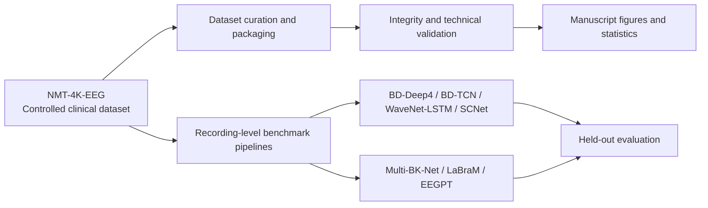
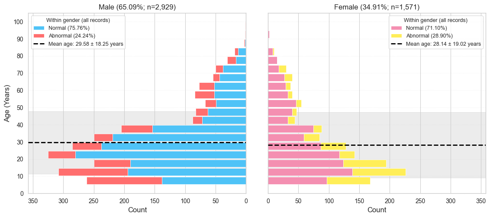
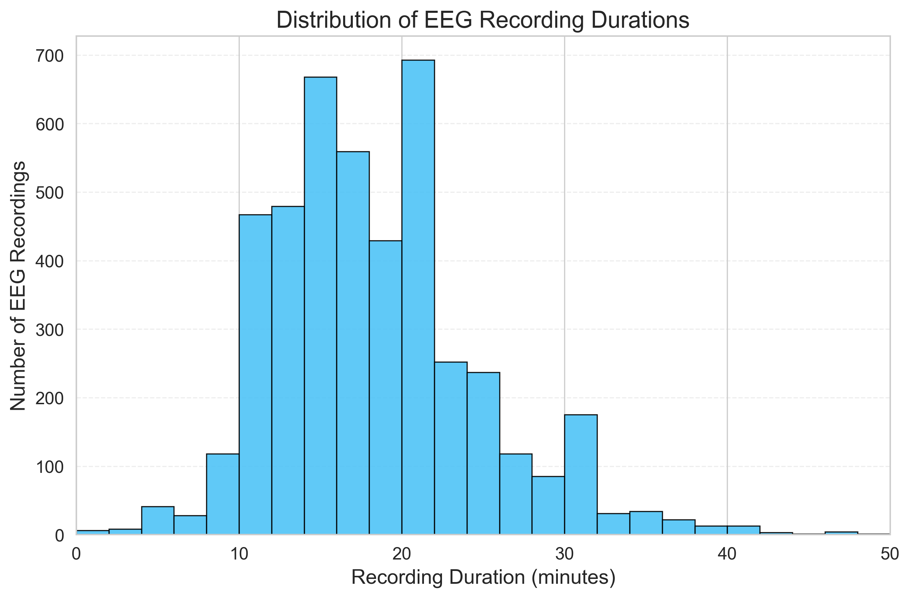
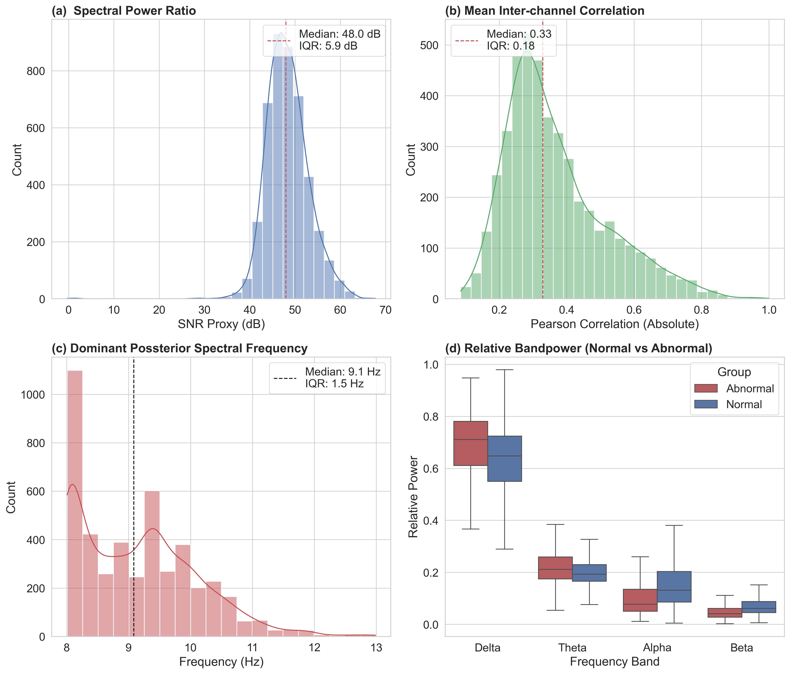
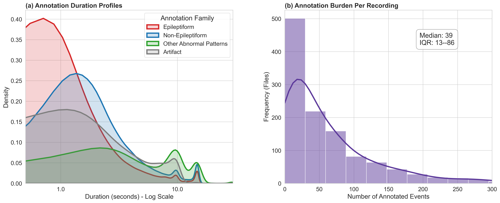

# NMT-4K-EEG: Dataset Code, Validation & Baseline Implementations

[](https://doi.org/10.5281/zenodo.21405022)
[](https://zenodo.org/records/23009612)
[](https://doi.org/10.5281/zenodo.21405022)
[](https://doi.org/10.5281/zenodo.20830355)


This repository is the **code, validation, reproducibility, and baseline implementation companion** to **NMT-4K-EEG**, a curated multimodal clinical electroencephalography resource developed from routine hospital EEG examinations in Pakistan.

It now brings together three complementary layers of reproducible work:

1. **Dataset engineering** — curation, predefined split construction, release packaging, cross-modal linkage, and checksum generation.
2. **Technical validation** — EDF integrity checks, annotation validation, signal characterization, dataset statistics, and manuscript figure generation.
3. **Baseline implementations** — end-to-end recording-level normal-vs-abnormal classification pipelines for **BD-Deep4, BD-TCN, WaveNet-LSTM, SCNet, Multi-BK-Net, LaBraM, and EEGPT**.

> [!IMPORTANT]
> The **clinical dataset files are distributed under controlled access**. The Zenodo record and metadata are publicly visible, but access to the clinical files requires an approved access request and agreement to the **NMT-4K-EEG Data Usage Agreement (DUA), version 1.0**. The DUA itself is publicly viewable.

### Quick links

| Resource | Link |
|---|---|
| NMT-4K-EEG dataset record | [doi:10.5281/zenodo.21405022](https://doi.org/10.5281/zenodo.21405022) |
| Public Data Usage Agreement | [Zenodo DUA record](https://zenodo.org/records/23009612) · [doi:10.5281/zenodo.23009612](https://doi.org/10.5281/zenodo.23009612) |
| Code and validation archive | [doi:10.5281/zenodo.20830355](https://doi.org/10.5281/zenodo.20830355) |
| Full EDF Viewer | [dll-ncai.github.io/full_edf_viewer](https://dll-ncai.github.io/full_edf_viewer/) |

## Contents

- [Dataset at a glance](#dataset-at-a-glance)
- [Data modalities](#data-modalities)
- [Repository structure](#repository-structure)
- [Notebooks](#notebooks)
- [Scripts](#scripts)
- [Baseline implementations](#baseline-implementations)
- [Output directories](#output-directories)
- [Dataset release structure](#dataset-release-structure)
- [Installation](#installation)
- [Recommended workflow](#recommended-workflow)
- [Reproducibility notes](#reproducibility-notes)
- [Data integrity verification](#data-integrity-verification)
- [Usage notes and limitations](#usage-notes-and-limitations)
- [Ethics and privacy](#ethics-and-privacy)
- [Controlled data access and DUA](#controlled-data-access-and-dua)
- [Code availability](#code-availability)
- [Citation](#citation)
- [License](#license)
- [Contact](#contact)


```mermaid
flowchart LR
    A[NMT-4K-EEG<br/>Controlled clinical dataset] --> B[Dataset curation and packaging]
    B --> C[Integrity and technical validation]
    C --> D[Manuscript figures and statistics]
    A --> E[Recording-level benchmark pipelines]
    E --> F[BD-Deep4 / BD-TCN / WaveNet-LSTM / SCNet]
    E --> G[Multi-BK-Net / LaBraM / EEGPT]
    F --> H[Held-out evaluation]
    G --> H
```

## Dataset at a glance

| Item | Description |
|---|---|
| Total recordings | 4,500 routine clinical EEG recordings from unique subjects |
| Recording-level classes | 3,336 normal and 1,164 abnormal |
| Training partition | 3,500 recordings, including 2,796 normal and 704 abnormal |
| Evaluation partition | 1,000 recordings, including 540 normal and 460 abnormal |
| Signal format | European Data Format, `.edf` |
| Channels | 19 scalp channels using the International 10-20 system |
| Sampling frequency | 200 Hz |
| Acquisition resolution | Native 12-bit acquisition |
| Event annotations | 77,461 expert-verified annotations for abnormal recordings |
| Annotation format | Comma-separated value files, `.csv` |
| Event taxonomy | 10 canonical labels organized into four broader annotation families |
| Clinical reports | 4,500 de-identified reports in plain text, `.txt` |
| Subject age | Six years and older |
| Data split | Fixed subject-wise training and evaluation partitions |
| Access model | Controlled access; DUA acceptance required before clinical files are released |

The released EDF recordings remain continuous and unsegmented. No preprocessing, artifact rejection, re-referencing, or manual signal cleaning was applied before release. Physiological and non-physiological artifacts from routine clinical acquisition are therefore retained.

## Data modalities

### Continuous EEG signals

Each recording is provided as an EDF file. The signals retain the original acquisition characteristics, including the 19-channel scalp montage, 200 Hz sampling frequency, linked-ear reference during acquisition, and native 12-bit system characteristics.

### Event-level annotations

Recordings interpreted as abnormal include annotation CSV files. Each released annotation contains:

| Field | Description |
|---|---|
| `Gender` | Recorded gender field from the source clinical record |
| `Age` | Subject age at the time of acquisition |
| `File Start` | Recording clock start time |
| `Start time` | Annotation onset clock time |
| `End time` | Annotation offset clock time |
| `Channel names` | Channels in which the annotated morphology was most prominent |
| `Comment` | Normalized clinical annotation label |

Normal recordings do not contain event annotation CSV files. Temporal overlap between annotations is permitted because different EEG patterns may occur at the same time or across different channel subsets.

### Clinical reports

Every recording is linked to a **de-identified clinical EEG report** in TXT format. The two contributing hospitals use related but site-specific reporting templates.

Typical report sections include:

- **Pak-Emirates Military Hospital (PEMH):** `Indications`, `Technique`, `Factual Report`, and `Impression`
- **Fauji Foundation Hospital (FFH):** `History`, `Procedure Status`, `EEG Description`, `EEG Classification`, and `Clinical Interpretation`

The reports provide recording-level clinical context and final interpretation. They are **not temporally aligned** with individual waveform samples or event annotations and should therefore not be treated as event-level ground truth.

### Recording identifiers

Files belonging to the same recording use a shared de-identified base identifier. Identifiers follow the source and year convention used during curation, for example:

```text
mh_2023_0000001.edf
mh_2023_0000001.csv
mh_2023_0000001.txt
```

The same convention is used for `ffh` identifiers. The CSV file is present only when the recording was interpreted as abnormal.

## Repository structure

```text
NMT-4K-EEG-Dataset/
├── notebooks/
│   ├── 01_dataset_characterization/
│   ├── 02_data_validation/
│   ├── 03_technical_validation/
│   └── 04_manuscript_outputs/
│
├── Scripts/
│   ├── Dataset Curation/
│   ├── Integrity/
│   └── Validation/
│
├── Baseline Implementations on NMT 4K/
│   ├── BD-Deep4/
│   ├── BD-TCN/
│   ├── EEGPT/
│   ├── LaBraM/
│   ├── Multi-BK-Net/
│   ├── SCNet/
│   └── WaveNet-LSTM/
│
├── Outputs/
│   ├── figures/
│   ├── nmt4k_analysis_results/
│   ├── nmt4k_event_level_stats/
│   ├── nmt4k_event_stats_out/
│   ├── nmt4k_signal_quality/
│   ├── nmt4k_step1_out/
│   ├── nmt4k_validation_out/
│   ├── Stats Ouput/
│   └── Validation Report/
│
├── CITATION.cff
├── LICENSE
├── requirements.txt
└── README.md
```

The baseline directory contains **seven independent experiment packages**. Each package includes its own configuration, preprocessing logic, training/evaluation entry points, dependency specification, and model-specific README. Some packages also contain unit tests, audit reports, helper launchers, and troubleshooting documentation.

## Notebooks

### `01_dataset_characterization/Abnormality_stats.ipynb`

This notebook analyzes abnormal annotation labels and recording-level abnormality patterns. It includes:

- Normalization of free-text clinical labels
- Mapping of label variants to canonical annotation labels
- Annotation frequency by annotation row
- Annotation frequency by recording
- Single and multiple abnormality combinations
- Label co-occurrence summaries
- Age and gender distributions across abnormality groups
- Tables and plots used to describe the event annotations

### `01_dataset_characterization/Datastats.ipynb`

This notebook describes the recording cohort and produces demographic and duration figures. It includes:

- Age distribution summaries
- Recorded gender distribution
- Normal and abnormal counts by age and gender
- Population pyramid visualization
- Recording duration distribution
- Dataset-level descriptive figures

### `02_data_validation/validation_data.ipynb`

This notebook performs EDF and annotation consistency checks. It includes:

- EDF readability checks
- Sampling frequency extraction
- Recording duration extraction
- Channel inventory checks
- Missing and additional channel summaries
- EDF-to-annotation file linkage
- Annotation onset and offset parsing
- Annotation timing validation
- Annotation channel validation
- Canonical label mapping
- Invalid row classification
- Annotation and channel frequency summaries

The notebook writes detailed validation tables to `Outputs/nmt4k_step1_out/` and `Outputs/nmt4k_validation_out/`.

### `03_technical_validation/data_analysis_paper.ipynb`

This notebook performs signal characterization, annotation-level analysis, and exploratory baseline analysis. It includes:

- Welch power spectral density estimation
- Relative EEG band powers
- Alpha peak estimation
- Signal quality summary metrics
- Flat channel summaries
- Interchannel signal statistics
- Annotation count and duration analysis
- Annotations per recording
- Annotation density summaries
- Exploratory recording-level feature extraction
- Exploratory logistic regression classification

### `03_technical_validation/Paper_Stats.ipynb`

This notebook produces technical validation statistics and publication figures. It includes:

- Raw label mapping audits
- Unmapped label reports
- Event timing checks
- Annotation channel checks
- Canonical label membership checks
- Signal-to-noise proxy estimates
- Interchannel correlation summaries
- Alpha peak estimates
- Relative band power summaries
- Signal quality figure generation

### `04_manuscript_outputs/final_paper_plot.ipynb`

This notebook assembles final figures, validation summaries, and table values used in the Data Descriptor. It includes:

- Age and gender visualization
- Recording duration visualization
- EDF integrity summaries
- Annotation consistency summaries
- Signal quality figure generation
- Annotation duration and density figures
- Annotation family plots
- LaTeX table row generation
- Final null and file checks

## Scripts

### `Scripts/Dataset Curation/build_dataset_manifest_and_split.py`

This script builds the recording-level manifest and creates the predefined split. It:

- Scans normal and abnormal EDF folders
- Scans annotation CSV and clinical report folders
- Normalizes file stems and recording labels
- Extracts source and year information from recording identifiers
- Links each recording to its EDF, annotation, and report files
- Detects duplicate recording identifiers
- Reports missing required files
- Calculates age from year and month fields
- Selects the final release records
- Creates the fixed training and evaluation partitions
- Uses a fixed seed for reproducible allocation
- Attempts to preserve source and year coverage across partitions
- Writes split summaries and coverage reports

The exact target counts are:

```text
Training normal:       2,796
Training abnormal:       704
Evaluation normal:       540
Evaluation abnormal:     460
Total:                 4,500
```

Main outputs include:

```text
recordings_updated_with_splits.tsv
missing_required_files.tsv
unused_records_not_selected.tsv
split_summary.tsv
split_year_coverage.tsv
duplicate_file_names_in_recordings.tsv
```

### `Scripts/Dataset Curation/package_release_files.py`

This script assembles the final release folders from the completed `recordings.tsv` manifest. It:

- Reads split and recording-level class assignments
- Indexes source EDF, annotation, and report files
- Copies each modality to the correct release folder
- Copies annotations only for abnormal recordings
- Detects missing and duplicate source files
- Preserves original file metadata during copying
- Checks expected counts in destination folders
- Writes copy logs and summary files

Main outputs include:

```text
copy_log.tsv
missing_files_during_copy.tsv
copy_summary.tsv
duplicate_source_files.tsv
destination_folder_validation.tsv
```

### `Scripts/Validation/verify_release_structure.py`

This script independently checks the packaged release against `recordings.tsv`. It:

- Verifies expected recording counts
- Builds the expected file inventory from the manifest
- Scans each training and evaluation subdirectory
- Identifies matched files
- Identifies missing files
- Identifies extra files or files in the wrong folder
- Identifies duplicate recording stems
- Confirms split, class, and modality consistency
- Produces folder-level validation summaries

Main outputs include:

```text
verification_matched_files.tsv
verification_missing_files.tsv
verification_extra_files.tsv
verification_duplicate_files.tsv
verification_summary.tsv
verification_recording_counts.tsv
```

### `Scripts/Integrity/generate_sha256_checksums.py`

This script creates a SHA-256 checksum manifest for the packaged dataset. It:

- Recursively scans the final dataset directory
- Excludes temporary files, cache folders, and validation logs
- Computes a SHA-256 digest for each included file
- Uses relative paths for portability
- Writes the checksum manifest to `metadata/sha256.txt`

## Baseline implementations

The repository includes seven end-to-end implementations for **recording-level Normal vs Abnormal EEG classification** on NMT-4K-EEG. These packages are intended to make model-specific preprocessing, optimization, checkpointing, aggregation, and held-out evaluation explicit and inspectable.

> [!WARNING]
> The baseline folders are **independent experiment environments**. Do not install every model's requirements into one shared Python environment. Create a separate environment per model and follow the README inside that model's folder.

### Benchmark principles shared across the implementations

The model packages follow the same high-level safeguards even when their architecture-specific preprocessing differs:

- The released **training** and **evaluation** partitions are preserved.
- Any internal validation subset is derived only from the released training partition.
- The official evaluation partition is reserved for final held-out assessment.
- **Abnormal** is treated as the positive class for binary metrics.
- Recording-level predictions are produced from windows/crops according to the aggregation rule documented for each model.
- Model selection and threshold selection are performed without tuning on the official evaluation labels.
- Clinical reports and event-level annotation CSVs are not used as inputs to these recording-level binary baselines.
- Generated caches, checkpoints, and run outputs should be stored outside the released clinical data folders whenever possible.

### Baseline overview

| Model | Implementation in this repository | Primary EEG input | Main pipeline |
|---|---|---|---|
| **BD-Deep4** | Independent PyTorch Deep ConvNet implementation | 19 scalp channels, 0.5–40 Hz, 100 Hz, 6 s windows | manifest → cache → train → recording-level evaluate |
| **BD-TCN** | Modern Braindecode TCN adaptation retaining the published BD-TCN architecture settings | 19 scalp channels, 0.5–40 Hz, 100 Hz, 60 s windows | validate → cache → dense TCN train → evaluate |
| **WaveNet-LSTM** | From-scratch PyTorch dual-path WaveNet-LSTM adaptation | 20-channel TCP bipolar montage, 0.5–40 Hz, 250 Hz, 60 s input | split → preprocess → train → evaluate |
| **SCNet** | Clean PyTorch reconstruction of SCNet | default: 19 scalp channels, 100 Hz, deterministic 7 min input | setup → cache → train → evaluate |
| **Multi-BK-Net** | Current native-PyTorch adaptation of the published multi-branch/multi-kernel network | 19 scalp channels, 100 Hz, 60 s windows | audit → preprocess → development/full training → evaluate |
| **LaBraM** | Fine-tuning pipeline around pretrained LaBraM-base | 21 EEG/reference channels, 200 Hz, 10 s windows | preprocess → manifest → fine-tune → recording-level evaluate |
| **EEGPT** | Fine-tuning pipeline around the released EEGPT base checkpoint with recording-level multiple-instance learning | 21 EEG/reference channels, 256 Hz, 4 s windows | verify → split → preprocess → audit → train → final evaluate |

### Reference baseline results

The current NMT-4K-EEG Data Descriptor reports the following single-run recording-level reference values on the 1,000-recording held-out evaluation partition. These values are **reference points**, not a promise of bit-for-bit reproduction by independently modernized implementations.

| Model | Accuracy (%) | F1 (%) | Sensitivity (%) | Specificity (%) | AUROC (%) |
|---|---:|---:|---:|---:|---:|
| BD-Deep4 | 76.90 | 72.86 | 67.39 | 85.00 | 76.20 |
| BD-TCN | 79.20 | 75.30 | 68.91 | 87.96 | 78.44 |
| WaveNet-LSTM | 67.00 | 63.66 | 62.83 | 70.56 | 66.69 |
| SCNet | 77.60 | 71.93 | 62.39 | 90.56 | 76.51 |
| LaBraM | 80.30 | 77.33 | 73.04 | 86.48 | 88.35 |
| EEGPT | 82.70 | 80.54 | 77.83 | 86.85 | 89.25 |
| Multi-BK-Net | 82.60 | 78.88 | 70.65 | 92.78 | 91.46 |

Differences can arise from framework versions, random initialization, pretrained checkpoint revisions, exact crop/window aggregation, threshold selection, filtering behavior, and explicit NMT-specific safety adaptations documented in each package.

### Model-specific packages

<details>
<summary><b>BD-Deep4</b></summary>

Path: [`Baseline Implementations on NMT 4K/BD-Deep4/`](./Baseline%20Implementations%20on%20NMT%204K/BD-Deep4/)

This package contains a complete Windows/PyTorch workflow with resumable preprocessing and training:

```text
00_check_gpu.py
01_prepare_manifest.py
02_preprocess_cache.py
03_train.py
04_evaluate.py
05_smoke_test_model.py
config.yaml
nmt_deep4/
requirements.txt
run_pipeline.bat
setup_windows.bat
```

The implementation uses the fixed NMT split, creates internal validation from training only, caches filtered/resampled EEG once, uses mixed precision, saves resumable checkpoints, tunes the binary threshold on validation only, and aggregates window probabilities to one probability per recording.

Quick start:

```powershell
cd "Baseline Implementations on NMT 4K/BD-Deep4"
python 00_check_gpu.py
python 01_prepare_manifest.py --config config.yaml
python 02_preprocess_cache.py --config config.yaml
python 03_train.py --config config.yaml
python 04_evaluate.py --config config.yaml --split evaluation
```

</details>

<details>
<summary><b>BD-TCN</b></summary>

Path: [`Baseline Implementations on NMT 4K/BD-TCN/`](./Baseline%20Implementations%20on%20NMT%204K/BD-TCN/)

The package uses modern Braindecode while preserving the important published BD-TCN architecture settings, including five temporal blocks, 55 filters, kernel size 16, and the dense temporal prediction mode used by default.

```text
01_check_setup.py
02_validate_dataset.py
03_build_cache.py
04_train.py
05_evaluate.py
bdtcn_nmt_utils.py
config.yaml
install_windows.ps1
requirements.txt
```

Quick start:

```powershell
cd "Baseline Implementations on NMT 4K/BD-TCN"
python 01_check_setup.py
python 02_validate_dataset.py --config config.yaml
python 03_build_cache.py --config config.yaml
python 04_train.py --config config.yaml --resume auto
python 05_evaluate.py --config config.yaml
```

</details>

<details>
<summary><b>EEGPT</b></summary>

Path: [`Baseline Implementations on NMT 4K/EEGPT/`](./Baseline%20Implementations%20on%20NMT%204K/EEGPT/)

EEGPT is organized as a Python package with explicit protocol auditing, checkpoint coverage checks, preprocessing diagnostics, tests, and Windows launchers. The pipeline uses native EEGPT four-second inputs at 256 Hz and recording-level multiple-instance learning rather than treating individual windows as independent test samples.

```text
configs/default.yaml
checkpoints/                  # user-supplied pretrained checkpoint
eegpt_nmt/                    # implementation package
docs/                         # experiment plan, audit, validation documentation
scripts/                      # ordered Windows launchers
tests/                        # cohort/protocol/metric tests
pyproject.toml
requirements.txt
```

Expected pretrained checkpoint location:

```text
checkpoints/eegpt_mcae_58chs_4s_large4E.ckpt
```

Canonical run order:

```text
scripts/00_verify_setup.bat
scripts/01_prepare_splits.bat
scripts/02_preprocess.bat
scripts/03_audit_data.bat
scripts/04_train.bat
scripts/05_final_evaluate.bat
```

The final evaluation command intentionally requires explicit confirmation so the official evaluation cohort is not used casually during development.

</details>

<details>
<summary><b>LaBraM</b></summary>

Path: [`Baseline Implementations on NMT 4K/LaBraM/`](./Baseline%20Implementations%20on%20NMT%204K/LaBraM/)

The LaBraM package fine-tunes **LaBraM-base** on 10-second NMT windows and includes recording-balanced sampling, validation-only threshold selection, modern AMP support, environment checks, resumable training, and recording-level metric export.

```text
check_labram_environment.py
prepare_nmt_manifest.py
run_nmt_finetuning.py
nmt_finetuning/
preprocess/
scripts/
requirements_nmt_cuda128.txt
constraints_nmt_cuda128.txt
COMPATIBILITY_REPORT.md
README.md
README_NMT_FINETUNING.md
```

This package requires the **upstream LaBraM source and pretrained checkpoint** to be supplied separately:

```text
LaBraM/
├── modeling_finetune.py
└── checkpoints/
    └── labram-base.pth
```

Typical manifest construction uses a validation subset derived from the original training partition and preserves original evaluation recordings as the final test set.

</details>

<details>
<summary><b>Multi-BK-Net</b></summary>

Path: [`Baseline Implementations on NMT 4K/Multi-BK-Net/`](./Baseline%20Implementations%20on%20NMT%204K/Multi-BK-Net/)

This is the most extensive standalone package in the baseline collection. It includes dataset auditing, resumable preprocessing, low-memory training helpers, optimized resume scripts, unit tests, paper-protocol documentation, validation reports, results guidance, and troubleshooting notes.

```text
00_create_environment.ps1
01_verify_install.ps1
02_inspect_dataset.ps1
03_preprocess.ps1
04_train.ps1
05_evaluate.ps1
06_resume_training.ps1
07_run_all.ps1
08_run_unit_tests.ps1
09_resume_optimized.ps1
config.yaml
multibknet_nmt/
docs/
tests/
requirements.txt
THIRD_PARTY_NOTICE.md
```

The default package uses automatic mixed precision and gradient accumulation to preserve a practical effective batch size on limited-VRAM hardware. Recording-level probabilities are obtained from the model's window predictions before final metrics are computed.

</details>

<details>
<summary><b>SCNet</b></summary>

Path: [`Baseline Implementations on NMT 4K/SCNet/`](./Baseline%20Implementations%20on%20NMT%204K/SCNet/)

The SCNet package is a PyTorch reconstruction with two preprocessing modes:

- `nmt4k19` — recommended NMT-4K mode using the 19 scalp channels
- `paper22` — optional mode reproducing the paper's 22 bipolar derivations more closely

```text
check_setup.py
preprocess.py
train.py
evaluate.py
config.yaml
src/
requirements.txt
install_windows.bat
run_pipeline.bat
```

Quick start:

```powershell
cd "Baseline Implementations on NMT 4K/SCNet"
python check_setup.py --config config.yaml
python preprocess.py --config config.yaml
python train.py --config config.yaml --resume auto
python evaluate.py --config config.yaml --threshold auto
```

</details>

<details>
<summary><b>WaveNet-LSTM</b></summary>

Path: [`Baseline Implementations on NMT 4K/WaveNet-LSTM/`](./Baseline%20Implementations%20on%20NMT%204K/WaveNet-LSTM/)

This package provides a from-scratch PyTorch implementation of the dual-path WaveNet-LSTM architecture adapted to the fixed NMT-4K split. It constructs the 20-channel TCP bipolar montage used by the model paper and resamples to 250 Hz so a 60-second input contains 15,000 samples.

```text
00_check_setup.py
01_make_splits.py
02_preprocess.py
03_train.py
04_evaluate.py
config.yaml
environment.yml
src/
requirements.txt
run_pipeline.ps1
```

Quick start:

```powershell
cd "Baseline Implementations on NMT 4K/WaveNet-LSTM"
python 00_check_setup.py --config config.yaml
python 01_make_splits.py --config config.yaml
python 02_preprocess.py --config config.yaml
python 03_train.py --config config.yaml --resume auto
python 04_evaluate.py --config config.yaml --split evaluation
```

</details>

### Before running any baseline

1. Obtain approved access to NMT-4K-EEG and preserve the released directory structure.
2. Read the model-specific `README.md` completely.
3. Update the dataset path in that model's `config.yaml` or equivalent configuration.
4. Create a **separate environment** for that model.
5. Run its setup/audit/smoke-test stage before preprocessing thousands of recordings.
6. Keep the official evaluation set untouched until the development choices for that run are frozen.
7. Save the exact configuration, random seed, checkpoint identity, and software versions with the final results.

### Pretrained-model requirements

| Model | External pretrained model required? | Notes |
|---|---|---|
| BD-Deep4 | No | Trained from scratch |
| BD-TCN | No | Trained from scratch using the documented architecture |
| WaveNet-LSTM | No | Trained from scratch |
| SCNet | No | Trained from scratch |
| Multi-BK-Net | No | Trained from scratch |
| LaBraM | **Yes** | Requires upstream LaBraM source and `labram-base.pth` |
| EEGPT | **Yes** | Requires the released EEGPT base checkpoint |

> [!NOTE]
> Upstream source code and pretrained checkpoints are subject to their original authors' licenses and distribution terms. They are not relicensed by the MIT License of this repository.

## Output directories

The `Outputs` directory contains saved tables, validation reports, and figures generated by the notebooks.

| Directory | Contents |
|---|---|
| `Outputs/figures/` | Main manuscript figures, including demographic, duration, signal quality, and annotation quality-control plots |
| `Outputs/nmt4k_analysis_results/` | Exploratory signal metrics, feature tables, annotation density plots, and feature importance outputs |
| `Outputs/nmt4k_event_level_stats/` | Annotation table summaries, annotation duration statistics, annotation density tables, and annotation-level plots |
| `Outputs/nmt4k_event_stats_out/` | Canonical and merged annotation counts, duration statistics, annotations per file, and related figures |
| `Outputs/nmt4k_signal_quality/` | Channel-level and recording-level signal quality tables and spectral figures |
| `Outputs/nmt4k_step1_out/` | Initial EDF integrity summary |
| `Outputs/nmt4k_validation_out/` | EDF-to-CSV linkage, annotation validation, label distributions, channel counts, and invalid row reports |
| `Outputs/Stats Ouput/` | Consolidated technical validation statistics |
| `Outputs/Validation Report/` | EDF validation report and file-level status information |

Saved outputs are included for transparency and inspection. Some outputs are intermediate artifacts from earlier notebook executions. Regenerate the outputs with the current dataset release before using them as final numerical results. Final regenerated outputs should consistently report 77,461 annotations, 10 canonical labels, and four annotation families.

## Example figures

<p align="center">
  
  
</p>

<p align="center">
  
  
</p>

## Dataset release structure

The data downloaded from Zenodo follows the structure below:

```text
NMT-4K-EEG/
├── train/
│   ├── normal/
│   │   ├── edf/
│   │   └── reports/
│   └── abnormal/
│       ├── edf/
│       ├── annotations/
│       └── reports/
├── evaluation/
│   ├── normal/
│   │   ├── edf/
│   │   └── reports/
│   └── abnormal/
│       ├── edf/
│       ├── annotations/
│       └── reports/
└── metadata/
    ├── recordings.tsv
    ├── report_linkage.tsv
    └── sha256.txt
```

## Installation

A recent Python 3 environment is recommended for the dataset-validation notebooks and scripts.

> [!IMPORTANT]
> The commands in this section install the **root dataset/validation environment only**. Baseline implementations have model-specific dependency files and should be installed in separate environments using the instructions inside each baseline folder.

```bash
git clone https://github.com/dll-ncai/NMT-4K-EEG-Dataset.git
cd NMT-4K-EEG-Dataset
```

Create and activate a virtual environment.

### Windows PowerShell

```powershell
python -m venv .venv
.venv\Scripts\Activate.ps1
```

### Linux or macOS

```bash
python3 -m venv .venv
source .venv/bin/activate
```

Install the required Python packages using the provided `requirements.txt` file:

```bash
pip install --upgrade pip
pip install -r requirements.txt
```

The main dependencies include NumPy, pandas, Matplotlib, seaborn, SciPy, scikit-learn, MNE-Python, tqdm, openpyxl, and Jupyter.

## Configuration

> [!IMPORTANT]
> The scripts and notebooks may contain absolute paths from the original curation environment. Update all dataset root and output paths before running the code.

The main path variables include:

```python
DATASET_FOLDER = Path("/path/to/source/dataset")
NMT_ROOT = Path("/path/to/NMT-4K-EEG")
RECORDINGS_TSV = NMT_ROOT / "metadata" / "recordings.tsv"
```

The released clinical reports are TXT files. For the final release workflow, report extensions should be restricted to:

```python
REPORT_EXTENSIONS = {".txt"}
```

The notebooks contain explicit label mapping dictionaries. These mappings should match the final 10-label taxonomy used in the released annotation files and manuscript. For dataset-level summaries, the 10 canonical labels are grouped into four broader annotation families: Epileptiform, Non-epileptiform slowing, Other abnormal patterns, and Artifact. In final release analyses, `Spike and Delta` is consolidated into `Spike and Wave`, and rows labeled `Normal` are excluded from released annotation analyses.

## Recommended workflow

### For dataset maintainers

Run the release preparation scripts in this order:

```text
1. Scripts/Dataset Curation/build_dataset_manifest_and_split.py
2. Scripts/Dataset Curation/package_release_files.py
3. Scripts/Validation/verify_release_structure.py
4. Scripts/Integrity/generate_sha256_checksums.py
```

Example commands from the repository root:

```bash
python "Scripts/Dataset Curation/build_dataset_manifest_and_split.py"
python "Scripts/Dataset Curation/package_release_files.py"
python "Scripts/Validation/verify_release_structure.py"
python "Scripts/Integrity/generate_sha256_checksums.py"
```

The curation and packaging scripts require access to the original source archive. Public dataset users do not need to rerun these steps.

### For dataset users

1. Download NMT-4K-EEG from Zenodo.
2. Extract the dataset while preserving its directory structure.
3. Update the root path variables in the required notebook.
4. Install the Python dependencies.
5. Run the validation or analysis notebook from top to bottom.
6. Save regenerated outputs in a separate directory to avoid overwriting included reference outputs.

### For baseline users

1. Obtain the dataset through the controlled-access process and verify the downloaded files.
2. Choose one model under `Baseline Implementations on NMT 4K/`.
3. Follow that model's local README instead of the root `requirements.txt`.
4. Run the package's environment/GPU/setup checker first.
5. Run preprocessing into a separate cache/output directory.
6. Train using only the released training partition and its internally derived validation subset.
7. Evaluate on the released evaluation partition only after model selection and threshold choices are finalized.
8. Retain the produced config, checkpoint, predictions, and metrics for reproducibility.

## Reproducibility notes

- Use the predefined training and evaluation partitions for comparable benchmarking.
- Do not use the evaluation partition for model selection or hyperparameter tuning.
- Create an internal validation subset only from the training partition when needed.
- Report preprocessing, montage handling, filtering, normalization, segmentation, and label mapping decisions.
- Parse event clock times using a datetime library, especially for recordings that cross midnight.
- Treat clinical reports as recording-level text and not as event-level ground truth.
- Treat annotation counts as annotation density and not as a direct measure of clinical disease burden.
- The released EDF files are raw clinical recordings. Benchmark-specific filtering does not modify the released data.
- Treat each baseline package as a separate experiment environment; record its exact package versions and configuration.
- Do not compare window-level and recording-level metrics as if they were equivalent; the primary benchmark is recording-level classification.
- For pretrained models, record the exact checkpoint filename/hash and loading coverage reported by the package.
- Any model-specific deviation from the original architecture paper or from the common NMT benchmark protocol should be documented explicitly.

## Data integrity verification

The checksum manifest can be verified with standard SHA-256 tools after downloading the dataset.

### Linux or macOS

```bash
cd /path/to/NMT-4K-EEG
sha256sum -c metadata/sha256.txt
```

### Windows PowerShell

```powershell
Get-Content metadata\sha256.txt | ForEach-Object {
    $parts = $_ -split "\s+", 2
    $expected = $parts[0]
    $file = $parts[1]
    $actual = (Get-FileHash -Algorithm SHA256 $file).Hash.ToLower()
    [PSCustomObject]@{
        File = $file
        Status = if ($actual -eq $expected) { "OK" } else { "MISMATCH" }
    }
}
```

## Usage notes and limitations

NMT-4K-EEG represents routine hospital EEG practice. The recordings contain natural variation in referral indications, vigilance states, duration, activation procedures, artifacts, and abnormal patterns.

Important limitations include:

- Sleep stages are not provided as separate structured annotations.
- Activation procedures are not provided as separate structured annotations.
- Reports provide recording-level context but are not temporally aligned with events.
- Normal recordings do not have event annotation files.
- Annotation labels reflect the released clinical taxonomy and may need task-specific aggregation.
- The acquisition system and montage may differ from other public EEG datasets.
- Baseline results validate technical usability and do not establish clinical performance.
- The dataset is not intended for direct clinical diagnosis or deployment without further validation.

## Ethics and privacy

The dataset was assembled retrospectively from routine diagnostic EEG records. The secondary use, curation, and release were reviewed by:

- Institutional Review Board of Pak-Emirates Military Hospital, Approval No. `51214MH`
- Institutional Review Board of Fauji Foundation Hospital, Approval No. `2024-IRB-A-56/56`

Written informed consent for the research use and sharing of de-identified clinical EEG data was obtained from adult participants; for participants under 18 years of age, consent was obtained from a parent or legal guardian.

Direct identifiers were removed from EDF headers, file names, annotation files, and clinical reports before release. Age and recorded sex were retained as limited demographic variables (the released metadata field is named `gender`). A shared de-identified identifier links the signal, report, and annotation file when available.

## Controlled data access and DUA

NMT-4K-EEG contains **de-identified clinical human data** and is distributed under **controlled access**.

- **Dataset record:** [https://doi.org/10.5281/zenodo.21405022](https://doi.org/10.5281/zenodo.21405022)
- **Dataset version:** 1.2
- **Public DUA:** [https://zenodo.org/records/23009612](https://zenodo.org/records/23009612)
- **DUA DOI:** [https://doi.org/10.5281/zenodo.23009612](https://doi.org/10.5281/zenodo.23009612)

The Zenodo dataset record and metadata remain publicly accessible, while the clinical dataset files are restricted. Prospective users must submit an access request through Zenodo and agree to the **NMT-4K-EEG Data Usage Agreement (DUA), version 1.0** before access can be granted.

The DUA defines the conditions for responsible reuse, including restrictions on participant re-identification and unauthorized redistribution and requirements for appropriate data-security safeguards.

> [!IMPORTANT]
> The MIT License in this GitHub repository applies to repository-authored software and documentation. It does **not** convert the controlled clinical dataset into open data. Dataset reuse is governed by the NMT-4K-EEG DUA and the access conditions associated with the Zenodo dataset record.

## Code availability

This GitHub repository provides the custom code used for:

- Dataset curation and fixed split construction
- Release packaging and cross-modal file organization
- EDF, metadata, annotation, and linkage validation
- Signal and spectral characterization
- Annotation timing, channel, and taxonomy checks
- Dataset statistics and manuscript figure generation
- SHA-256 checksum generation
- Reproducible recording-level baseline implementations for seven EEG architectures

The included baseline implementations are:

```text
BD-Deep4
BD-TCN
EEGPT
LaBraM
Multi-BK-Net
SCNet
WaveNet-LSTM
```

A fixed archival release of the code and validation repository is available through Zenodo:

- **Code archive DOI:** [10.5281/zenodo.20830355](https://doi.org/10.5281/zenodo.20830355)
- **Code archive landing page:** [https://zenodo.org/records/20830355](https://zenodo.org/records/20830355)

The browser-based **Full EDF Viewer** used during EEG visualization and annotation is available at:

[https://dll-ncai.github.io/full_edf_viewer/](https://dll-ncai.github.io/full_edf_viewer/)

> [!NOTE]
> When a new GitHub release adds or changes baseline implementations, create a corresponding Zenodo software version so the archival snapshot and GitHub repository remain synchronized.

## Citation

Please cite the **dataset** when using NMT-4K-EEG. Please also cite the **code and validation repository** when using or referring to the scripts, notebooks, validation workflow, baseline implementations, or reproduced figures. For LaBraM, EEGPT, and other literature-derived architectures, also cite the corresponding original model paper as described in the model-specific README. The citation exported by each Zenodo record should be treated as the authoritative citation.

### Dataset citation

```bibtex
@dataset{masood_nmt4keeg_2026,
  author    = {Masood, Hira and Shafait, Faisal and Bajwa, Muhammad Naseer and Malik, Muhammad Imran and Shafait, Saima and Khan, Hassan Aqeel},
  title     = {{NMT-4K-EEG: A Curated Clinical EEG Dataset for Normal and Abnormal EEG Detection}},
  year      = {2026},
  publisher = {Zenodo},
  version   = {1.2},
  doi       = {10.5281/zenodo.21405022},
  url       = {https://doi.org/10.5281/zenodo.21405022}
}
```

### Code and validation repository citation

```bibtex
@software{masood2026nmt4keegcode,
  author    = {Masood, Hira and Shafait, Faisal and Bajwa, Muhammad Naseer and Malik, Muhammad Imran and Shafait, Saima and Khan, Hassan Aqeel},
  title     = {{NMT-4K-EEG Dataset Code and Validation Repository}},
  year      = {2026},
  publisher = {Zenodo},
  version   = {v1.0.0},
  doi       = {10.5281/zenodo.20830355},
  url       = {https://doi.org/10.5281/zenodo.20830355}
}
```


## License

The repository-authored source code, scripts, notebooks, and documentation are licensed under the [MIT License](LICENSE), unless a subdirectory explicitly states otherwise.

Copyright (c) 2026 Deep Learning Lab - NCAI.

The following are **not** covered by the repository MIT License:

- The NMT-4K-EEG clinical dataset files, which are distributed separately under controlled access and governed by the [NMT-4K-EEG DUA](https://zenodo.org/records/23009612)
- Third-party upstream source code included or referenced by a baseline package
- Pretrained LaBraM or EEGPT checkpoints and other externally distributed model weights

Always review the applicable upstream license before redistributing third-party code or pretrained weights.

## Contact

For questions about the dataset, code, or manuscript, please open a GitHub issue or contact:

- **Faisal Shafait:** [faisal.shafait@seecs.edu.pk](mailto:faisal.shafait@seecs.edu.pk)
- **Hira Masood:** [hira.masood@seecs.edu.pk](mailto:hira.masood@seecs.edu.pk)

## Acknowledgment

The dataset was created through collaboration between the School of Electrical Engineering and Computer Science at the National University of Sciences and Technology, the Deep Learning Laboratory at the National Center of Artificial Intelligence, Pak-Emirates Military Hospital, Fauji Foundation Hospital, and collaborating researchers.
